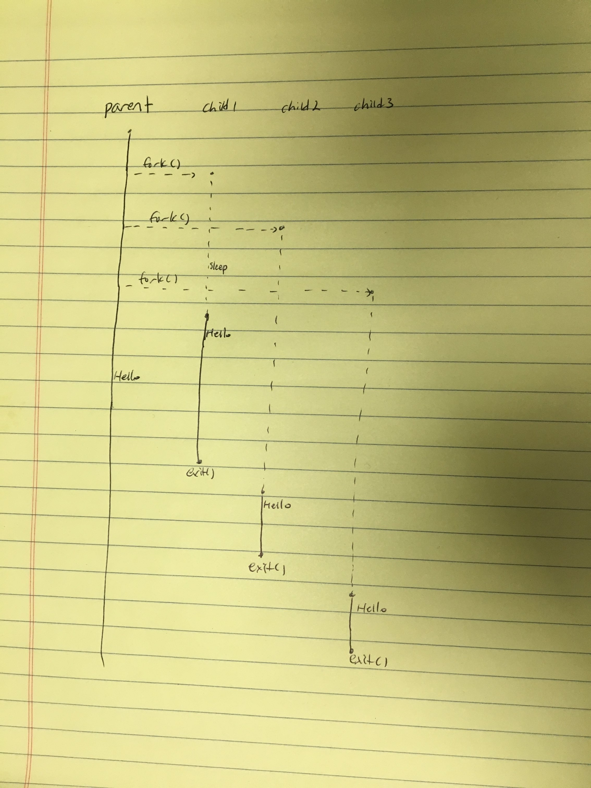

## Homework 9

### C Exercises

Modify the link below so it points to the `ex09` directory in your
student repository.

[Here is a link to the ex09 directory in my repository](https://github.com/SungwooPark/ExercisesInC/tree/master/exercises/ex09)

Thread Diagram

### Think OS Chapter 9 reading questions

1) Why does each thread have its own stack?
- So threads can call functions without interfering with each other.

2) What does the gcc flag `-lpthread` do?
- Tells the compiler to link the Pthread library.

3) What does the argument of `pthread_exit` do?
- The argument is used to pass a value to the thread that joins with this thread.

4) Normally the same thread that created a thread also waits to join it.
What happens if another thread tries to join a thread it did not create?
- It is blocked from joining it.

5) What goes wrong if several threads try to increment a shared integer at the same time?
- You are not guaranteed the sequence of the events. In other words, you cannot be sure which increments will happen first.

6) What does it mean to "lock a mutex"?
- To prevent other thread to execute the code block that the current thread is on.
