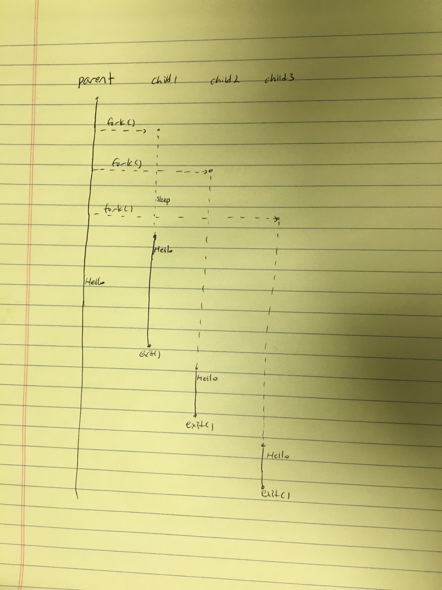

## Homework 10

### C Exercises

Modify the link below so it points to the `ex12` directory in your
student repository.  That's right, Homework 10 is to do Exercise 12.

[Here is a link to the ex12 directory in my repository](https://github.com/SungwooPark/ExercisesInC/tree/master/exercises/ex12)

Exercise writeup

### Think OS Chapter 10 reading questions

1) What does it mean to say that a data structure is thread safe?
- A data structure is thread safe if multiple threads can access the data structure without compromising the consistency of the stored data.

2) In the circular buffer implementation of a queue, why is the maximum number of elements in the queue `n-1`,
if `n` is the size of the array?
- Because a queue loops around to the beginning when it reaches the end.

3) If there is no mutex to protect the queue, give an example of a sequence of steps that could leave
the queue in an inconsistent state.
- One thread adds an element to the queue. Before this thread can increment `next_in` index, other thread can add another element in the newly updated spot.

4) When a thread calls `cond_wait`, why does it have to unlock the mutex before blocking?
- So other thread can access the queue.

5) When a thread returns from `cond_wait`, what do we know is definitely true?  What do we think is probably true?
- We know that the conditional signal has been sent, and we think that the condition state is probably true.

6) What happens if you signal a condition variable when there are no waiting threads?
- The signal has no effect.

7) Do you have to lock the mutex to signal a condition variable?
- You don't have to lock the mutex to signal a condition variable.

8) Does the condition have to be true when you signal a condition variable?
- The condition does not have to be true when you signal a condition variable.
